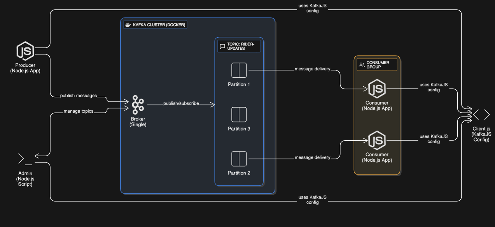

# Kafka Learning Project (Node.js)

## 📌 Overview
This project is a **hands-on learning setup for Apache Kafka using Node.js**.  
It demonstrates how to:

- Create topics in Kafka  
- Produce messages (publish data)  
- Consume messages (subscribe to data streams)  
- Understand Kafka partitions and consumer groups  

The goal is to gain a **practical understanding of event streaming** with Kafka and how it can be integrated into modern applications.

---

## ❓ What is Apache Kafka?
Apache Kafka is a **distributed event streaming platform** capable of handling **high-throughput, fault-tolerant, real-time data pipelines**.  

It allows applications to **publish (write)** and **subscribe (read)** records (messages) in a **scalable and durable way**.

---

## 🚀 Why Kafka? (The Problem it Solves)
Modern systems need to handle **real-time data** flowing between multiple services such as:  
- Payment events  
- IoT device logs  
- User activity tracking  

Traditional databases/queues are **not built to**:
- Handle millions of events per second  
- Scale horizontally across distributed systems  
- Ensure reliability when services crash  

**Kafka solves this by:**
- Acting as a **durable message broker**  
- Handling **real-time streaming at scale**  
- Supporting **publish/subscribe messaging and consumer groups** for parallel processing  

---

## 🛠️ Tech Stack
- **Apache Kafka** (via Docker container)  
- **Node.js** with [KafkaJS](https://kafka.js.org/) library  
- **Producer / Consumer / Admin APIs**  


---

## ⚡ Getting Started

### 1. Run Kafka with Docker
Make sure Docker is installed. Then run:

```bash
docker run -d --name kafka -p 9092:9092 \
  -e KAFKA_ZOOKEEPER_CONNECT=192.168.1.1:2181 \
  -e KAFKA_LISTENER_SECURITY_PROTOCOL_MAP=PLAINTEXT:PLAINTEXT \
  -e KAFKA_ADVERTISED_LISTENERS=PLAINTEXT://<YOUR_IP_ADDRESS>:9092 \
  -e KAFKA_OFFSETS_TOPIC_REPLICATION_FACTOR=1 \
  confluentinc/cp-kafka:7.4.4

# 🏗️ Kafka Learning Project Architecture

This document explains the **system architecture** of the Kafka Learning Project built with **Node.js** and **KafkaJS**.

---

## 📌 Overview

The architecture demonstrates how different components interact in an **event streaming pipeline** using **Apache Kafka**:

- **Producer (Node.js App)** → Publishes messages to Kafka topics  
- **Kafka Broker (Docker)** → Manages topics and partitions, stores messages  
- **Consumer (Node.js App)** → Reads messages from Kafka topics  
- **Admin (Node.js Script)** → Manages Kafka topics and configuration  
- **Client.js** → Shared KafkaJS configuration used by Producer, Consumer, and Admin  

---

## 🔄 Workflow

1. **Producer** sends messages to the **Kafka Broker**.  
2. The **Broker** stores messages in the defined **topic partitions**.  
3. **Consumers** subscribe to topics (via consumer groups) and receive partitioned messages.  
4. **Admin** script manages topic creation and other broker tasks.  
5. **Client.js** provides shared KafkaJS configuration across Producer/Consumer/Admin.  

---

## 🖼️ Architecture Diagram



---

## ✅ Key Concepts Illustrated

- **Kafka Topic & Partitions** → Ensures scalability and parallel message consumption  
- **Producer → Broker → Consumer Flow** → Real-time event streaming  
- **Consumer Groups** → Enable load balancing among multiple consumers  
- **Single Broker (Dockerized)** → Simplified setup for learning purposes  

---

## 🚀 Next Steps

- Extend setup with **multiple brokers** for a real Kafka cluster  
- Add **replication** for fault tolerance  
- Integrate with **databases or APIs** for real-world data pipelines  

---

